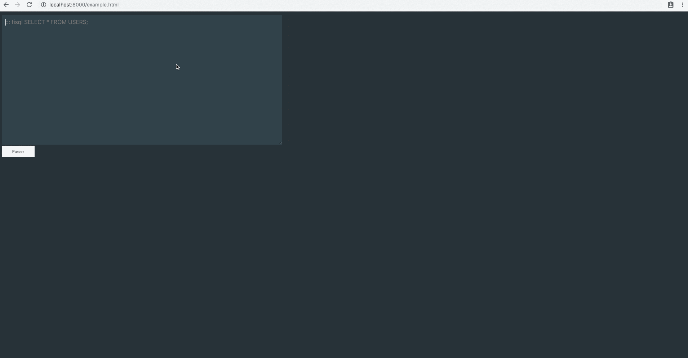

# TiDB Wasm Markdown

This is a markdown-it plugin to run TiDB Wasm Instance on markdown so that you can have an interactive playground to learn SQL in the browser. 


Enjoy TiDB on Markdown.

# Install

```sh
git clone https://github.com/imiskolee/tidb-wasm-markdown.git
cd tidb-wasm-markdown
python -m SimpleHTTPServer 8000
```
open `http://localhost:8000/example.html`

1. Use the `::: tisql ` keyword before your SQL statements
2. Click Parser to parse the Markdown to HTML. The TiDB Wasm instance will be automatically launched and output the results in the editor.


# Demo



# Screenshot


# Road Map

* Support more controls instruction

