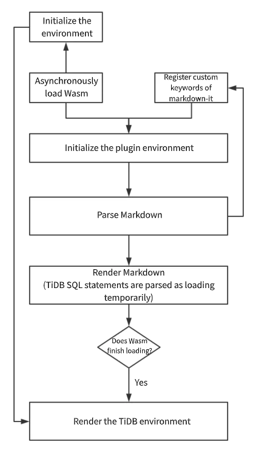

# Introduction of TiDB Wasm Markdown

[TiDB Wasm Markdown](https://github.com/imiskolee/tidb-wasm-markdown) is a markdown-it plugin that runs a TiDB Wasm instance on Markdown. With this tool, you can have an interactive playground to learn SQL in the browser. 

This document mainly introduces what inspires TiDB Wasm Markdown, the implementation process of this project, TiDB Wasm Markdown's workflow and usage, and some issues to resolve.

## What inspires this project?

TiDB Wasm Markdown is inspired by an article titled [TiDB in the Browser: Running a Golang Database on WebAssembly](https://pingcap.com/blog/tidb-in-the-browser-running-a-golang-database-on-webassembly/). The article describes how to run [TiDB](https://github.com/pingcap/tidb) (an open-source database which supports pluggable storage engine) directly in a web browser. [TiDB-Wasm](http://play.pingcap.com/) is great work, and it also provides a good idea about Wasm application.

When learning a programming language, programmers can try the code in an interactive environment like [JSFiddle](http://jsfiddle.net/) and [Go Playground](https://play.golang.org/). These environments can also be embedded in teaching articles, and then learners can get interactive tutorials. However, currently, learners can just read database-teaching articles without an embedded environment to play with. They can't get hands-on practice while reading.  

Generally, server resources consumed by an interactive playground for programming languages are controllable, and the costs are affordable to users. By contrast, example data for a simple index optimization might occupy gigabytes of memory and consume many more CPU resources. The costs are unaffordable. But TiDB-Wasm solves this problem. Because users build the environment in the client, the environment costs fall on the corresponding user. 

Based on this, I came up with an idea that TiDB-Wasm as a playground environment for a database can be embedded in Markdown to interact with users.

## The implementation process

1. Downloaded related resources from https://play.pingcap.com, and analyzed the working process of the application. (An interesting finding: during the deployment, Wasm was disguised as an application named `main.css`. Maybe this aimed to reuse Nginx compression and caching policies.)

2. Looked for a Markdown parser that can easily embed custom tags, work on the front-end, and support plugins. After spending half an hour learning and searching for resources online, I chose markdown-it and markdown-it-container.

3. Spent one hour learning the markdown-it API and the source code and principles of markdown-it-container. 

4. Began the demo test.

5. Simply refactored and enwrapped the code.

6. Developed an example application.

7. [JinSong](https://github.com/ouesiengi) slightly refactored the example application. Thanks for his help to refine the application appearance.

## The workflow diagram



## Usage

```
::: tisql        SELECT * FROM USERS;
| Fixed tag content     | SQL content |
```

For details, see the [demo](https://github.com/imiskolee/tidb-wasm-markdown#demo) application.

## Issues

- Currently, it easily crashes in Chrome.
- Wasm has a big size. Its size needs to be optimized.
- Currently, for the performance's sake, it only supports running a single database instance on one Markdown file.
- Needs defined Markdown methods to describe interactive behaviors of a database.